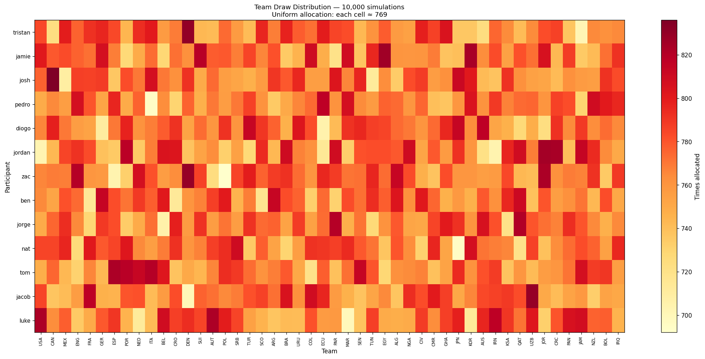

# Make America Goal Again

A World Cup 2026 sweepstake for friends. Built with Next.js 16, Supabase Postgres, and styled after BBC Ceefax teletext.

## Features

- Username + password sign-in (hashed with scrypt, no email required)
- Manual team draw via Python script — 10 000 simulated draws prove uniform distribution; one is randomly selected and written to Supabase
- Teletext page-code navigation — type a 3-digit code on your keyboard to jump to any page (100, 101, 200, 300, 400, 500, 600)
- Live fixture list and leaderboard powered by openfootball.json
- Bookies' Specials — side prizes that auto-award to whoever's team triggers the event first
- Wooden spoon — for the first player with all teams knocked out
- PIN-gated admin panel for draw management and the paid-in ledger
- Hourly Vercel cron keeps match data and specials current

## Stack

- **Next.js 16** (App Router) + React 19 + Tailwind 4 + TypeScript
- **Supabase Postgres** — data, RLS, no pg_cron required
- **iron-session** — signed HMAC cookie auth
- **Python 3.12** — setup scripts (user seeding, team draw, distribution plot)
- **Vercel** — hosting + hourly cron job

## Page codes (teletext navigation)

Type any 3-digit code on your keyboard while on the site to jump to that page:

| Code | Page |
|------|------|
| 100 | Leaderboard |
| 101 | Team allocation |
| 200 | Fixture list |
| 300 | My teams |
| 400 | Draw ceremony |
| 500 | Sign in |
| 600 | Admin |

## First-time setup

### 1. Deploy schema

```bash
supabase link --project-ref <your-project-ref>
supabase db push
```

### 2. Clear any existing data

```bash
supabase db execute --file supabase/truncate_all.sql --project-ref <your-project-ref>
```

### 3. Create `users.txt`

One user per line, format `username:password`. Lines starting with `#` are ignored.
The user named `admin` (or pass `--admin <name>`) is created as a spectator and excluded from the draw.

```
# World Cup 2026 sweepstake
admin:your-admin-password
alice:word-word-word
bob:another-passphrase
```

**Do not commit this file** — it's already in `.gitignore`.

### 4. Seed users

```bash
.venv/bin/python scripts/seed_users.py users.txt
```

### 5. Run the draw

```bash
.venv/bin/python scripts/run_draw.py
```

This runs 10 000 simulated draws, saves a heatmap to `public/draw_distribution.png`, then writes one randomly selected draw to Supabase.

### Draw distribution proof



Each cell shows how many times that participant received that team across 10 000 simulations. A uniform colour across the grid proves the distribution is fair.

## Local development

```bash
npm install

# Copy .env.example to .env.local and fill in:
#   SUPABASE_URL, SUPABASE_SERVICE_ROLE_KEY
#   SESSION_SECRET (openssl rand -base64 48)
#   CRON_SECRET, ADMIN_PIN

npm run dev
```

Trigger a manual data refresh at any time:

```bash
curl http://localhost:3000/api/cron/refresh?secret=<CRON_SECRET>
```

## Deployment

1. Push to GitHub, import the repo on [vercel.com/new](https://vercel.com/new)
2. Set environment variables in Vercel dashboard (see `.env.example`)
3. Run `supabase db push` to apply migrations
4. Run the Python setup scripts above against the production Supabase project
5. Visit `/admin`, enter your PIN, hit **REFRESH FROM OPENFOOTBALL** to seed match data

## Project structure

```
app/
  page.tsx          # Homepage — leaderboard + specials
  signin/           # Sign-in (username + password)
  me/               # Personal dashboard — your teams + specials
  schedule/         # Full fixture list
  ceremony/         # The draw ledger
  admin/            # PIN-gated admin — draw, refresh, paid-in ledger
  api/cron/refresh/ # Cron endpoint — hourly data refresh + event detection
components/
  PageCodeInput.tsx # Teletext page-code navigation (client)
  MastheadBar.tsx   # Header with interactive page number
  …                 # BBC Ceefax-themed UI components
lib/
  allocator.ts      # Deterministic Fisher-Yates team draw (used by admin re-roll)
  leaderboard.ts    # Points + standings computation
  openfootball.ts   # Fetch + Zod + cache adapter
  specials/         # Side prize defaults + event evaluator
  db.ts             # Supabase typed wrapper
scripts/
  seed_users.py     # Create participants from users.txt
  run_draw.py       # 10k draw simulation, heatmap, write allocation to DB
  requirements.txt  # Python dependencies
supabase/
  migrations/       # Versioned schema
  truncate_all.sql  # Clear all data before re-seeding
```
